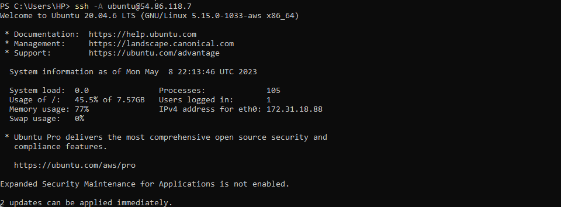

### ANSIBLE CONFIGURATION MANAGEMENT – AUTOMATE PROJECT 7 TO 10

In Projects 7 to 10 a lot of manual operations was used  to set up virtual servers, install and configure required software and deploy web application.

This Project will open our minds to appreciate DevOps tools even more by making most of the routine tasks automated with [Ansible Configuration Management,](https://www.redhat.com/en/topics/automation/what-is-configuration-management#:~:text=Configuration%20management%20is%20a%20process,in%20a%20desired%2C%20consistent%20state.&text=Managing%20IT%20system%20configurations%20involves,building%20and%20maintaining%20those%20systems.) at the same time bolster confidence at writing code using declarative language such as YAML.

Let us get started! 🏋️‍♀️🏋️‍♀️🏋️‍♀️🏋️‍♀️🏋️‍♀️

A [Jump Server](https://en.wikipedia.org/wiki/Jump_server) (sometimes also referred as [Bastion Host](https://en.wikipedia.org/wiki/Bastion_host)) is an intermediary server through which access to internal network can be provided. If you think about the current architecture you are working on, ideally, the webservers would be inside a secured network which cannot be reached directly from the Internet. 
That means, even DevOps engineers cannot SSH into the Web servers directly and can only access it through a Jump Server – it provide better security and reduces [attack surface.](https://en.wikipedia.org/wiki/Attack_surface)
On the diagram below the Virtual Private Network (VPC) is divided into [two subnets](https://docs.aws.amazon.com/vpc/latest/userguide/VPC_Subnets.html) – Public subnet has public IP addresses and Private subnet is only reachable by private IP addresses.


Project 15, will expose our learning to a Bastion host in proper action. But for now, we will develop Ansible scripts to simulate the use of a Jump box/Bastion host to access our Web Servers.

### Task:

- Install and configure Ansible client to act as a Jump Server/Bastion Host

- Create a simple Ansible playbook to automate servers configuration

## INSTALL AND CONFIGURE ANSIBLE ON EC2 INSTANCE

Update Name tag on your Jenkins EC2 Instance to Jenkins-Ansible. We will use this server to run playbooks.

- In your GitHub account create a new repository and name it ansible-config-mgt.

- Install Ansible

`sudo apt update`

`sudo apt install ansible`

- Check your Ansible version by running


`ansible --version`

Configure Jenkins build job to save your repository content every time you change it – this will solidify your Jenkins configuration skills acquired in Project 9.

- Create a new Freestyle project ansible in Jenkins and point it to your ‘ansible-config-mgt’ repository.

- Configure Webhook in GitHub and set webhook to trigger ansible build.

- Configure a Post-build job to save all (**) files, like you did it in Project 9.

- Test your setup by making some change in README.MD file in master branch and make sure that builds starts automatically and Jenkins saves the files (build artifacts) in following folder ls /var/lib/jenkins/jobs/job-name/builds/build_number/archive/


Note: Trigger Jenkins project execution only for /main (master) branch.

Follow the steps [here](https://github.com/Jobijollof/DevOps-Projects/blob/main/Project%209%20Introduction%20to%20Jenkins/README.md) to setup Jenkins.  

After creating your first free style project, do the following,

- Click on configure on the left

- Click on git source code management and place the Url of Ansible-config-mgt repo


- Click on build now


- Errors


- Error message


- Go back to configure and make this change


- Successful build


Now your setup will look like this:


- Trigger a change in the repo Ansible-config-mgt. Edit the README.md

observation build wasn't triggered automatically i have to still build manually.

[Article helped](https://www.edureka.co/community/49753/auto-build-job-jenkins-there-change-code-github-repository)


***Tip*** Every time you stop/start your Jenkins-Ansible server – you have to reconfigure GitHub webhook to a new IP address, in order to avoid it, it makes sense to allocate an Elastic IP to your Jenkins-Ansible server (This was done in Project 10). Note that Elastic IP is free only when it is being allocated to an EC2 Instance, so do not forget to release Elastic IP once you terminate your EC2 Instance.

By default, the artifacts are stored on the Jenkins server locally to check that,

```
ls /var/lib/jenkins/jobs/job-name/builds/build_number/archive/

ls /var/lib/jenkins/jobs/project-tooling/builds/3/archive/

```


### Prepare your development environment using Visual Studio Code

First part of ‘DevOps’ is ‘Dev’, which means you will require to write some codes and you shall have proper tools that 
will make your coding and debugging comfortable – you need an [Integrated development environment (IDE)](https://en.wikipedia.org/wiki/Integrated_development_environment) or [Source-code Editor](https://en.wikipedia.org/wiki/Source-code_editor). There is a plethora of different IDEs and Source-code Editors for different languages with their own advantages and drawbacks, you can choose whichever you are comfortable with, but i recommend one free and universal editor that will fully satisfy your needs – [Visual Studio Code (VSC),](https://en.wikipedia.org/wiki/Visual_Studio_Code) you can get it [here](https://code.visualstudio.com/download).

After you have successfully installed VSC, configure it to connect to your newly created GitHub repository.

### Configure github repo to connect with VSC.

- Download remote development pack on VSC


- [Helpful article](https://www.techrepublic.com/article/add-github-vs-code/)


Clone down your ansible-config-mgt repo to your Jenkins-Ansible instance


`git clone <ansible-config-mgt repo link>`


## BEGIN ANSIBLE DEVELOPMENT


In your ansible-config-mgt GitHub repository, create a new branch that will be used for development of a new feature.

`git checkout -b prj-11`


- Tip: Give your branches descriptive and comprehensive names, for example, if you use Jira or Trello as a project management tool – include ticket number (e.g. PRJ-145) in the
name of your branch and add a topic and a brief description what this branch is about – a bugfix, hotfix, feature, release (e.g. feature/prj-145-lvm)

- Checkout the newly created feature branch to your local machine and start building your code and directory structure

- Create a directory and name it playbooks – it will be used to store all your playbook files.


- Create a directory and name it inventory – it will be used to keep your hosts organised.

- Within the playbooks folder, create your first playbook, and name it common.yml

- Within the inventory folder, create an inventory file (.yml) for each environment (Development, Staging Testing and Production) dev, staging, uat, and prod respectively.


### Set up an Ansible Inventory

An Ansible inventory file defines the hosts and groups of hosts upon which commands, modules, and tasks in a playbook operate. Since our intention is to execute Linux commands on remote hosts, and ensure that it is the intended configuration on a particular server that occurs. It is important to have a way to organize our hosts in such an Inventory.
Save below inventory structure in the inventory/dev file to start configuring your development servers. Ensure to replace the IP addresses according to your own setup.
Note: Ansible uses TCP port 22 by default, which means it needs to ssh into target servers from Jenkins-Ansible host – for this you can implement the concept of ssh-agent. Now you need to import your key into [ssh-agent](https://smallstep.com/blog/ssh-agent-explained/#:~:text=ssh%2Dagent%20is%20a%20key,you%20connect%20to%20a%20server.&text=It%20doesn't%20allow%20your%20private%20keys%20to%20be%20exported.):


- Add key to  ssh agent

```
eval `ssh-agent -s`
```

This command did not work


- [Helpful article](https://stackoverflow.com/questions/18683092/how-to-run-ssh-add-on-windows)

`ssh-add <path-to-private-key>`


`ssh -A ubuntu@[PublicIP]`



- To make it persistent run the following command.  (This means that as ansible will be able to access any instance with the same key pair.)

`ssh-add -l`


- To connect to the other servers with the same key pair

```
ssh [server type@publicipaddress]
ssh ubuntu@ip

```


Now, ssh into your Jenkins-Ansible server using ssh-agent
ssh -A ubuntu@public-ip
Also notice, that your Load Balancer user is ubuntu and user for RHEL-based servers is ec2-user.
- I tried this configuration again on another set of servers and found out that using gitbash gives for a smoother experience.


Update your inventory/dev.yml file with this snippet of code:

[nfs]

(NFS-Server-Private-IP)-Address ansible_ssh_user='ec2-user'

[webservers]

(Web-Server1-Private-IP-Address) ansible_ssh_user='ec2-user'
(Web-Server2-Private-IP-Address) ansible_ssh_user='ec2-user'

[db]

(Database-Private-IP-Address) ansible_ssh_user='ubuntu' 

[lb]

(Load-Balancer-Private-IP-Address) ansible_ssh_user='ubuntu'


### CREATE A COMMON PLAYBOOK

- Create a Common Playbook

It is time to start giving Ansible the instructions on what you needs to be performed on all servers listed in ***inventory/dev***.
In ***common.yml*** playbook you will write configuration for repeatable, re-usable, and multi-machine tasks that is common to systems within the infrastructure.
Update your playbooks/common.yml file with following code:

```
---
- name: update web, nfs and db servers
  hosts: webservers, nfs, db
  remote_user: ec2-user
  become: yes
  become_user: root
  tasks:
    - name: ensure wireshark is at the latest version
      yum:
        name: wireshark
        state: latest

- name: update LB server
  hosts: lb
  remote_user: ubuntu
  become: yes
  become_user: root
  tasks:
    - name: Update apt repo
      apt: 
        update_cache: yes

    - name: ensure wireshark is at the latest version
      apt:
        name: wireshark
        state: latest

```        


Examine the code above and try to make sense out of it. This playbook is divided into two parts, each of them is intended to perform the same task: install wireshark utility (or make sure it is updated to the latest version) on your RHEL 8 and Ubuntu servers. It uses root user to perform this task and respective package manager: yum for RHEL 8 and apt for Ubuntu.

Feel free to update this playbook with following tasks:

- Create a directory and a file inside it
- Change timezone on all servers
- Run some shell script
…
For a better understanding of Ansible playbooks – [watch this video from RedHat](https://youtu.be/ZAdJ7CdN7DY) and [read this article.](https://www.redhat.com/en/topics/automation/what-is-an-ansible-playbook)

### Update GIT with the latest code

Now all of your directories and files live on your machine and you need to push changes made locally to GitHub.
In the real world, you will be working within a team of other DevOps engineers and developers. It is important to learn how to collaborate with help of GIT. In many organizations there is a development rule that do not allow to deploy any code before it has been reviewed by an extra pair of eyes – it is also called "Four eyes principle".
Now you have a separate branch, you will need to know how to raise a Pull Request (PR), get your branch peer reviewed and merged to the master branch.
Commit your code into GitHub:

- use git commands to add, commit and push your branch to GitHub from  Prj-11 branch.

```
git status

git add <selected files>

git commit -m "commit message"

```
- You are pushing to prj-11 branch. 
### Create a Pull request (PR)

- Wear the hat of another developer for a second, and act as a reviewer.

- If the reviewer is happy with your new feature development, your code will be merged to the master branch.


Once your code changes appear in main branch – Jenkins will do its job and save all the files (build artifacts) to ***/var/lib/jenkins/jobs/job-name/ansible/builds/<build_number>/archive/ directory*** on Jenkins-Ansible server.

- Check Jenkins for recent build


- Check server for build 

```
/var/lib/jenkins/jobs/job-name/ansible/builds/<build_number>/archive

sudo ls /var/lib/jenkins/jobs/project-tooling/builds/5/archive/

```


- Head back on your terminal, checkout from the feature branch into the main, and pull down the latest changes.

```
git checkout main

git pull

```

### RUN FIRST ANSIBLE TEST:

Now, it is time to execute ansible-playbook command and verify if your playbook actually works.


- You can go to each of the servers and check if wireshark has been installed by running which wireshark or wireshark --version


[end](https://media.giphy.com/media/2aGluESYp6PWP2DYgY/giphy.gif)


