# ANSIBLE DYNAMIC ASSIGNMENTS (INCLUDE) AND COMMUNITY ROLES

In Ansible, there are two ways to include external files or other playbooks: the import statement which we learnt in [Project 12](https://github.com/Jobijollof/DevOps-Projects2/tree/main/Project12-Ansible-Refactoring) and the include statement, which we will execute in this project. These statements allow you to reuse existing code, break down your playbooks into smaller parts, and organize your Ansible configuration more effectively.

### Import statement:

The import statement is used to incorporate external files or playbooks into the main playbook. It includes the content of the imported file directly into the main playbook at the point where the statement is used. The imported content is treated as if it was written in place.
The import statement is like copying and pasting the content of the imported playbook or task directly into the main playbook at the location of the import statement.
The imported content becomes part of the main playbook and is treated as if it was originally written there.
When you use import, the imported tasks or playbooks run at the same level as the tasks in the main playbook.
You can use variables and other resources defined in the main playbook within the imported content, and vice versa.


- name: Main Playbook
  hosts: localhost
  tasks:
    - name: Task 1
      # Some task...

    - name: Import Playbook 2
      import_playbook: playbook2.yml

    - name: Task 2
      # Some task...


### Include statement:

The include statement is used to include external files or playbooks into the main playbook. However, unlike the import statement, the include statement treats the included content as a separate entity that is executed independently. The included file or playbook is processed as if it were a separate playbook.
Here's an example of using the include statement:

```
yaml
Copy code
- hosts: servers
  tasks:
    - name: Include tasks from another playbook
      include: path/to/other-playbook.yml

    - name: Perform other tasks in the main playbook
      # Additional tasks go here

```      
In this example, the tasks defined in the other-playbook.yml file will be executed separately as if it was a stand alone playbook. Once the included tasks are executed, the execution flow continues with the remaining tasks in the main playbook.

Both import and include statements provide flexibility and reusability in Ansible playbooks. You can choose the appropriate statement based on whether you want the included content to be treated as part of the main playbook (import) or as a separate playbook (include).

```
import = Static
include = Dynamic

```

# INTRODUCING DYNAMIC ASSIGNMENT INTO OUR STRUCTURE


In your https://github.com/<your-name>/ansible-config-mgt GitHub repository start a new branch and call it dynamic-assignments.

```
git checkout -b dynamic-assignments

```

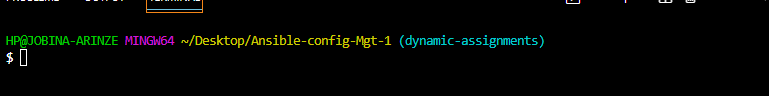


Create a new folder, name it dynamic-assignments. Then inside this folder, create a new file and name it env-vars.yml. We will instruct site.yml to include this playbook later. For now, let us keep building up the structure.

Your GitHub shall have following structure by now.

Note: Depending on what method you used in the previous project you may have or not have roles folder in your GitHub repository – if you used ansible-galaxy, then roles directory was only created on your Jenkins-Ansible server locally. It is recommended to have all the codes managed and tracked in GitHub, so you might want to recreate this structure manually in this case – it is up to you.

```
├── dynamic-assignments
│   └── env-vars.yml
├── inventory
│   └── dev
    └── stage
    └── uat
    └── prod
└── playbooks
    └── site.yml
└── roles (optional folder)
    └──...(optional subfolders & files)
└── static-assignments
    └── common.yml

```   

Since we will be using the same Ansible to configure multiple environments, and each of these environments will have certain unique attributes, such as servername, ip-address etc., we will need a way to set values to variables per specific environment.
For this reason, we will now create a folder to keep each environment’s variables file. Therefore, create a new folder env-vars, then for each environment, create new YAML files which we will use to set variables.

In Ansible, the files with extensions like .yml or .yaml are commonly used to define playbooks and configurations. The files dev.yml, prod.yml, stage.yml, and uat.yml, correspond to different environments in a deployment pipeline, such as development (dev), production (prod), staging (stage), and user acceptance testing (UAT).

These YAML files are typically used to define variables, roles, tasks, and configurations specific to each environment. They allow you to manage and deploy your infrastructure and applications consistently across multiple environments with different settings. Let's look at the significance of each file:

- dev.yml: This file contains the playbook or configuration specific to the development environment. It may include variables, roles, tasks, and other settings required for deploying and managing your application in the development environment.

- prod.yml: The prod.yml file is used for the production environment. It includes the playbook or configuration tailored for deploying your application in a production-ready manner. It may have different settings compared to the development environment, such as production database connections, optimized performance configurations, and stricter security measures.

- stage.yml: This file corresponds to the staging environment, which is often used to mimic the production environment closely. Staging environments allow you to test and validate your application in an environment that closely resembles the production setup. The stage.yml file contains the playbook or configuration for the staging environment, including specific variables, tasks, and configurations relevant to staging.

- uat.yml: UAT stands for User Acceptance Testing, which is performed to ensure that the application meets the requirements and expectations of end-users. The uat.yml file contains the playbook or configuration specific to the UAT environment. It may include tasks and configurations necessary for testing the application in a controlled UAT environment.

Your layout should now look like this.

```

├── dynamic-assignments
│   └── env-vars.yml
├── env-vars
    └── dev.yml
    └── stage.yml
    └── uat.yml
    └── prod.yml
├── inventory
    └── dev
    └── stage
    └── uat
    └── prod
├── playbooks
    └── site.yml
└── static-assignments
    └── common.yml
    └── webservers.yml

```


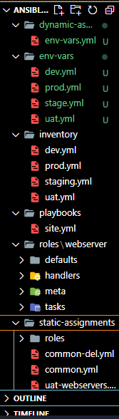


Now paste the instruction below into the `env-vars.yml` file.


```
---
- name: collate variables from env specific file, if it exists
  hosts: all
  tasks:
    - name: looping through list of available files
      include_vars: "{{ item }}"
      with_first_found:
        - files:
            - dev.yml
            - stage.yml
            - prod.yml
            - uat.yml
          paths:
            - "{{ playbook_dir }}/../env-vars"
      tags:
        - always

```


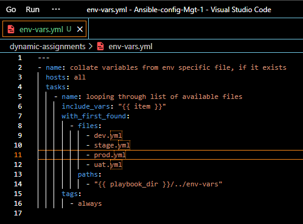


Notice 3 things to note here:

We used include_vars syntax instead of include, this is because Ansible developers decided to separate different features of the module.

From Ansible version 2.8, the include module is deprecated and variants of include_* must be used. These are:

[include_role](https://docs.ansible.com/ansible/latest/collections/ansible/builtin/include_role_module.html#include-role-module)

[include_tasks](https://docs.ansible.com/ansible/latest/collections/ansible/builtin/include_tasks_module.html#include-tasks-module)

[include_vars](https://docs.ansible.com/ansible/latest/collections/ansible/builtin/include_vars_module.html#include-vars-module)

In the same version, variants of import were also introduces, such as:

[import_role](https://docs.ansible.com/ansible/latest/collections/ansible/builtin/import_role_module.html#import-role-module)

[import_tasks](https://docs.ansible.com/ansible/latest/collections/ansible/builtin/import_tasks_module.html#import-tasks-module)

We made use of [special variables](https://docs.ansible.com/ansible/latest/reference_appendices/special_variables.html) `{{ playbook_dir }}` and `{{ inventory_file }}`. `{{ playbook_dir }}` will help Ansible to determine the location of the running playbook, and from there navigate to other path on the filesystem.

`{{ inventory_file }}` on the other hand will dynamically resolve to the name of the inventory file being used, then append .yml so that it picks up the required file within the env-vars folder.

We are including the variables using a loop. with_first_found implies that, looping through the list of files, the first one found is used. This is good so that we can always set default values in case an environment specific env file does not exist.

### Update `site.yml` file with dynamic assignment 
NB At this point, tests cannot be carried out it yet We are just setting the stage for what is yet to come. 

- site.yml should now look like this.

```

---
- hosts: all
- name: Include dynamic variables 
  tasks:
  import_playbook: ../static-assignments/common.yml 
  include: ../dynamic-assignments/env-vars.yml
  tags:
    - always

-  hosts: webservers
- name: Webserver assignment
  import_playbook: ../static-assignments/webservers.yml

```

# Community Roles

Now it is time to create a role for MySQL database – it should install the MySQL package, create a database and configure users.  Why bother going through the stress of creating a role for mysql when we can leverage community roles. There are tons of roles that have already been developed by other open source engineers out there. These roles are actually production ready, and dynamic to accomodate most of Linux flavours. With Ansible Galaxy again, we can simply download a ready to use ansible role, and keep going.

This is my explanation of everything up until this point.
In the world of technology, there's a fantastic tool called Ansible. It's like a magical assistant that helps you automate and manage tasks on your computers and servers. Think of it as your own personal helper to make your tech life easier!

Now, imagine you have a bunch of friends, and each friend is good at doing different things. One friend is great at cooking, another is a pro at cleaning, and there's one who can fix anything. With Ansible, you can gather all your friends' skills and put them to work for you!

In Ansible, your friends are called "roles." Each role has a specific set of abilities and tasks they can do. For example, the "web server" role knows how to set up a website, and the "database" role can manage your data.

You don't have to teach your friends what to do each time; they already know their tasks. Instead, you can tell Ansible which friends (roles) you need and what tasks they should perform. Ansible will then coordinate all your friends to work together and get the job done smoothly.

But here's the best part: You don't need to write down every detail for your friends. You can use "playbooks" to give them all the instructions they need. A playbook is like a to-do list for your friends. You tell Ansible what you want to achieve, and it takes care of the rest!

Now, Ansible also has a big library of playbooks and roles that the whole tech community shares. It's like a treasure chest of ready-made solutions! If you need your friends to do something common, you can find a playbook in the treasure chest that matches your needs. You don't have to start from scratch; you can build on what others have done!

So, in a nutshell, Ansible is your magical tech assistant that can call on your skilled friends (roles) to do all sorts of tasks for you. With its help and the treasure chest of shared playbooks, you can automate and manage your tech world with ease!


### Download MySQL Ansible Role

We will be using a MySQL role developed by geerlingguy. Hint: To preserve your your GitHub in actual state after you install a new role – make a commit and push to master your ‘ansible-config-mgt’ directory. Make sure you have git installed and configured on Jenkins-Ansible server and, for more convenient work with codes, you can configure Visual Studio Code to work with this directory. 
In this case, you will no longer need webhook and Jenkins jobs to update your codes on Jenkins-Ansible server, so you can disable it – we will be using Jenkins in later.

On Jenkins-Ansible server make sure that git is installed with `git --version` then go to ‘ansible-config-mgt’ directory and run.

Check if the Ansible-config.mgt repo exists if not clone the repo


```
cd ansible-config-mgt
git init
git pull https://github.com/<your-name>/ansible-config-mgt.git
git remote add origin https://github.com/<your-name>/ansible-config-mgt.git
git branch roles-feature
git switch roles-feature

```

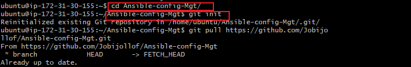

At this point i realised that my dynamic assignments branch was not up to date with the main branch because all the changes did not reflect after cloning the repo.


To merge dynamic-assignments branch with the main (or master) branch using Visual Studio Code, i followed these steps:

Step 1: Open the Terminal
Open Visual Studio Code and click on the "Terminal" menu at the top, then select "New Terminal" to open a new integrated terminal.

Step 2: Switch to the Main Branch
Ensure you are on the main branch by running the following command in the terminal:

`git checkout main`

Step 3: Pull Latest Changes
Before merging, it's a good practice to pull the latest changes from the remote main branch to ensure you have the most up-to-date code:

`git pull origin main`

Step 4: Merge the Branch
Now, merge the branch you want to merge into the main branch. Suppose you want to merge a branch called "feature-branch" into the main branch:

`git merge feature-branch`


Step 5: Resolve Conflicts (if any)

If there are any conflicts between the main branch and the feature branch, you will need to resolve them manually. Visual Studio Code provides a built-in merge conflict resolution tool to help you with this. Open the file with conflicts, and you will see the conflict markers. Edit the file to resolve the conflicts, then save the file.( I did not have conflicts so there was no need for this step)

Step 6: Commit the Merge

After resolving the conflicts, stage the changes and commit the merge:

`git add .`

`git commit -m "Merge feature-branch into main"`

Step 7: Push the Changes
Finally, push the merged changes to the remote repository:

`git push origin main`

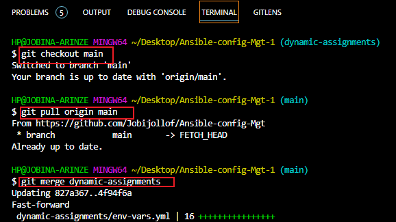

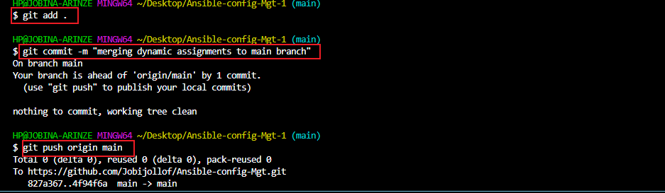


I ran `git pull https://github.com/<your-name>/ansible-config-mgt.git` again to pull down the new changes to my terminal.

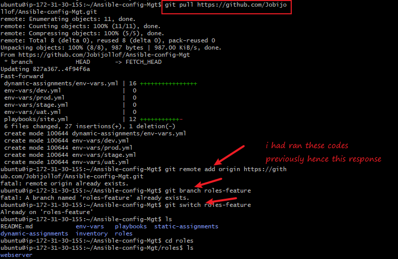

Inside roles directory create your new MySQL role with 

`ansible-galaxy install geerlingguy.mysql` and rename the folder to mysql

`mv geerlingguy.mysql/ mysql`

Read README.md file, and edit roles configuration to use correct credentials for MySQL required for the tooling website. Now it is time to upload the changes into your GitHub:

```
git add .
git commit -m "Commit new role files into GitHub"
git push --set-upstream origin roles-feature

```

Another error: I could not push to github.

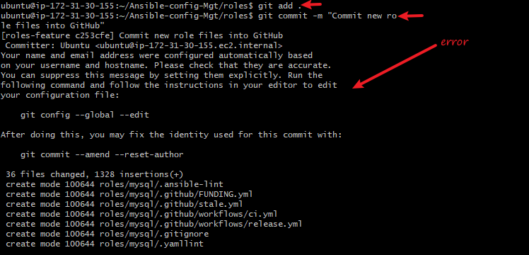

Resolution:

`ssh-keygen`

Type enter 3 times

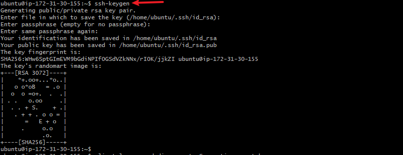

- use the cat command to display the key

`cat /home/ubuntu/.ssh/id_rsa.pub`

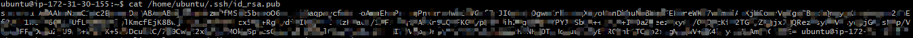

- copy it and paste in the ssh key section on github

- go to your gitub account settings

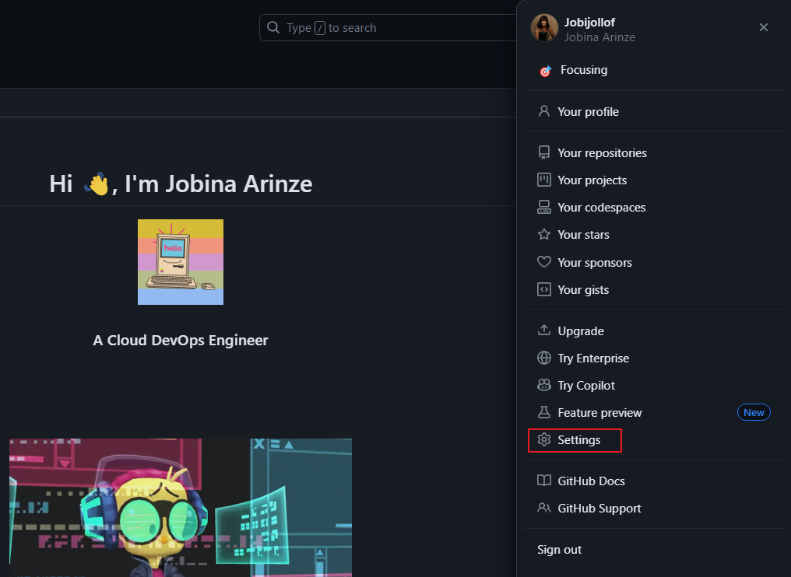

- add an ssh key, paste the key copied earlier and input your password to complete the process

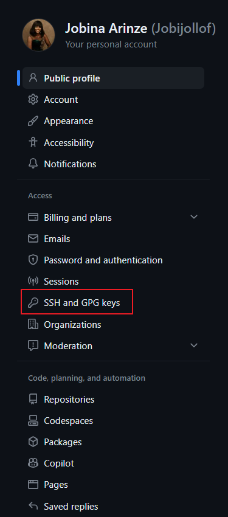


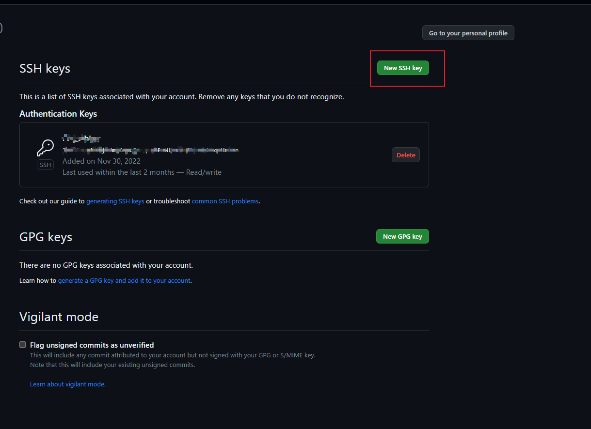

- return to the instance terminal and run the git add and commit and when pushing use this:

```
git remote set-url origin git@github:<username>/<repo name>

```

- then run:

```
git push --set-upstream origin roles-feature

```

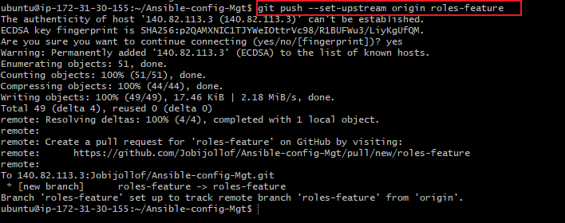


