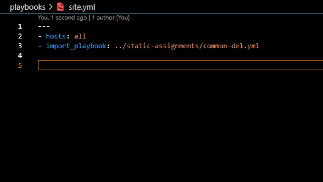
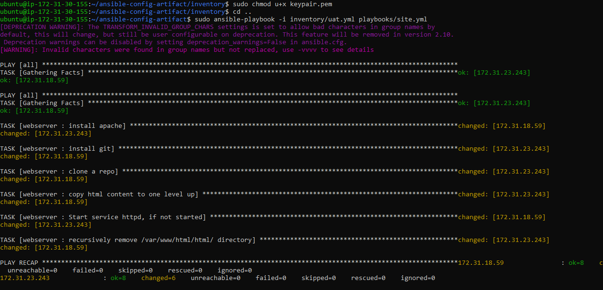

# ANSIBLE REFACTORING AND STATIC ASSIGNMENTS (IMPORTS AND ROLES)

- In this project we will continue working with ansible-config-mgt repository and make some improvements of our code. 

- We are going to refactor our Ansible code, create assignments, and learn how to use the imports functionality. 

- Imports allow to effectively re-use previously created playbooks in a new playbook. 

## Code Refactoring

Refactoring is a general term in computer programming. It means making changes to the source code without changing expected behavior of the software. The main idea of refactoring is to enhance code readability, increase maintainability and extensibility, reduce complexity, add proper comments without affecting the logic.

In our case, we will move things around a little bit in the code, but the overall state of the infrastructure remains the same.

Let us see how you can improve our Ansible code!

### Step 1 – Jenkins job enhancement

We will begin, by making some changes to our Jenkins job – now every new change in the code creates a separate directory which is not very convenient when we want to run some commands from one place. 
Futhermore, it consumes space on the Jenkins server with subsequent changes. 

We would enhance it by introducing a new Jenkins project/job – we will require Copy Artifact plugin.

In our Jenkins-Ansible server we will create a new directory called ansible-config-artifact.  We will store there all artifacts after each build.

`sudo mkdir /home/ubuntu/ansible-config-artifact`

Change permissions to this directory, so Jenkins could save files there – chmod -R 0777 /home/ubuntu/ansible-config-artifact


Go to Jenkins web console -> Manage Jenkins -> Manage Plugins -> on Available tab search for 
Copy Artifact and install this plugin without restarting Jenkins


Create a new Freestyle project and name it save_artifacts.
This project will be triggered by completion of your existing ansible project. Configure it accordingly:

- The main idea of save_artifacts project is to save artifacts into ***/home/ubuntu/ansible-config-artifact*** directory. To achieve this, create a Build step and choose Copy artifacts from other project, specify ansible as a source project and /home/ubuntu/ansible-config-artifact as a target directory.


- Note: You can configure number of builds to keep in order to save space on the server, for example, you might want to keep only last 2 or 5 build results. You can also make this change to your ansible job.


We are going to test our set up by making some changes in README.MD file inside our ansible-config repository (right inside master branch).

If both Jenkins jobs have completed one after another – you shall see our files inside /home/ubuntu/ansible-config-artifact directory and it will be updated with every commit to our main branch.


## REFACTOR ANSIBLE CODE BY IMPORTING OTHER PLAYBOOKS INTO SITE.YML

DevOps philosophy implies constant iterative improvement for better efficiency – refactoring is one of the techniques that can be used, but you always have an answer to question "why?". Why do we need to change something if it works well?

[In Project 11](https://github.com/Jobijollof/DevOps-Projects2/tree/main/Project-11%20Ansible-Config) we wrote all tasks in a single playbook common.yml.

Now it is a simple set of instructions for only 2 types of OS, but imagine we have many more tasks and we need to apply this playbook to other servers with different requirements. 
In this case, we will have to read through the whole playbook to check if all tasks written there are applicable and if there  is anything that we would need to add for certain server/OS families.
Very fast, it becomes a tedious exercise and our playbook will become messy with many commented parts. Your DevOps colleagues will not appreciate such organization of your codes and it will be difficult for them to use your playbook.
Most Ansible users learn the one-file approach first. However, breaking tasks up into different files is an excellent way to organize complex sets of tasks and reuse them.

### Execution:

- Refactor Ansible code by importing other playbooks into site.yml
Before starting to refactor the codes,  we would ensure that we have pulled down the latest code from master (main) branch.

- Create a new branch, name it refactor.

Let see code re-use in action by importing other playbooks.

- Within playbooks folder, create a new file and name it site.yml – This file will now be considered as an entry point into the entire infrastructure configuration. Other playbooks will be included here as a reference. In other words, site.yml will become a parent to all other playbooks that will be developed. Including common.yml that was created previously.


- Create a new folder in root of the repository and name it static-assignments. The static-assignments folder is where all other children playbooks will be stored. This is merely for easy organization of your work. It is not an Ansible specific concept, therefore you can choose how you want to organize your work. You will see why the folder name has a prefix of static very soon. For now, just follow along.


- Move common.yml file into the newly created static-assignments folder.


After Moving  common.yml file into static-assignments folder, import common.yml playbook into 
site.yml file.

```
---
- hosts: all
- import_playbook: ../static-assignments/common.yml

```


The code above uses built in [import_playbook](https://docs.ansible.com/ansible/latest/collections/ansible/builtin/import_playbook_module.html) Ansible module.

Your folder structure should look like this;


### Run ansible-playbook command against the dev environment
There is a  need to apply some tasks to our dev servers and  since we already have wireshark installed, we will go ahead and create another playbook under static-assignments and name it common-del.yml. In this playbook,  we will configure the deletion of wireshark utility.

```
---
- name: update web, nfs and db servers
  hosts: webservers, nfs, db
  remote_user: ec2-user
  become: yes
  become_user: root
  tasks:
  - name: delete wireshark
    yum:
      name: wireshark
      state: removed

- name: update LB server
  hosts: lb
  remote_user: ubuntu
  become: yes
  become_user: root
  tasks:
  - name: delete wireshark
    apt:
      name: wireshark-qt
      state: absent
      autoremove: yes
      purge: yes
      autoclean: yes


```

- update site.yml with: 

import_playbook: ../static-assignments/common-del.yml instead of common.yml and run it against dev  servers.



```
cd /home/ubuntu/ansible-config-mgt/

ansible-playbook -i inventory/dev.yml playbooks/site.yaml

```

- I had an error


- Solution to error. I had to add the path to the keypair to dev.yml


Make sure that wireshark is deleted on all the servers by running
`wireshark --version`

We have now learned how to use import_playbooks module and we have a ready solution to install/delete packages on multiple servers with just one command.


## CONFIGURE UAT WEBSERVERS WITH A ROLE ‘WEBSERVER’

- Configure UAT Webservers with a role ‘Webserver’

We have our nice and clean dev environment, so let us put it aside and configure 2 new Web Servers as uat. 
We could write tasks to configure Web Servers in the same playbook, but it would be too messy, instead, we will use a dedicated role to make our configuration reusable.

- Launch 2 fresh EC2 instances using RHEL 8 image.  We are going to use them as our uat servers. Name servers accordingly – Web1-UAT and Web2-UAT.

Tip: Do not forget to stop EC2 instances that you are not using at the moment to avoid paying extra. For now, you only need 2 new RHEL 8 servers as Web Servers and 1 existing Jenkins-Ansible server up and running.


To create a role, we must create a directory called roles/, relative to the playbook file or in /etc/ansible/ directory.
There are two ways how you can create this folder structure:

1.  Use an Ansible utility called ansible-galaxy.  Inside ansible-config-mgt/roles directory (you need to create roles directory upfront)

```
mkdir roles
cd roles
ansible-galaxy init webserver

```
2. Create the directory/files structure manually from branch refactor


- Note: You can choose either way, but since we store all our codes in GitHub, it is recommended to create folders and files there rather than locally on Jenkins-Ansible server.
The entire folder structure should look like below, but if you create it manually – you can skip creating tests, files, and vars or remove them if you used ansible-galaxy

```

└── webserver
    ├── README.md
    ├── defaults
    │   └── main.yml
    ├── files
    ├── handlers
    │   └── main.yml
    ├── meta
    │   └── main.yml
    ├── tasks
    │   └── main.yml
    ├── templates
    ├── tests
    │   ├── inventory
    │   └── test.yml
    └── vars
        └── main.yml

```

After removing unnecessary directories and files, the roles structure should look like this

```
└── webserver
    ├── README.md
    ├── defaults
    │   └── main.yml
    ├── handlers
    │   └── main.yml
    ├── meta
    │   └── main.yml
    ├── tasks
    │   └── main.yml
    └── templates

```    


Update your inventory ansible-config-mgt/inventory/uat.yml file with IP addresses of your 2 UAT Web servers


```
[uat-webservers]
<Web1-UAT-Server-Private-IP-Address> ansible_ssh_user='ec2-user' ansible_ssh_private_key_file=<path-to-pem-file>
<Web2-UAT-Server-Private-IP-Address> ansible_ssh_user='ec2-user' ansible_ssh_private_key_file=<path-to-pem-file>

```
NOTE: Ensure you are using ssh-agent to ssh into the Jenkins-Ansible instance just as you have done in project 11;
To learn how to setup SSH agent and connect VS Code to your Jenkins-Ansible instance, please see this video:
For Windows users – [ssh-agent on windows](https://youtu.be/OplGrY74qog)
For Linux users – [ssh-agent on linux](https://youtu.be/OplGrY74qog)


- Copy your keypair from your local machine into your EC2 Instance using SCP

- cd into the folder that you have your kepair located then run

```
 scp -i <"Name-of-keypair-used-to-ssh-into-the-instance"> <Name-of-kepair-that-you-want-to-copy> <username@public-IP:><path-to-copy-to/>

```


- Edit the  /etc/ansible/ansible.cfg file.

- Uncomment roles_path string and provide a full path to your roles directory 

- roles_path = /home/ubuntu/ansible-config-mgt/roles, so Ansible could know where to find configured role


It is time to start adding some logic to the webserver role. Go into tasks directory, and within the main.yml file, start writing configuration tasks to do the following:

1. Install and configure Apache (httpd service)

2. Clone Tooling website from [GitHub](https://github.com/Jobijollof/tooling).

3. Ensure the tooling website code is deployed to /var/www/html on each of 2 UAT Web servers.

4. Make sure httpd service is started


- Your main.yml may consist of following tasks:

```

---
- name: install apache
  become: true
  ansible.builtin.yum:
    name: "httpd"
    state: present

- name: install git
  become: true
  ansible.builtin.yum:
    name: "git"
    state: present

- name: clone a repo
  become: true
  ansible.builtin.git:
    repo: https://github.com/<your-name>/tooling.git
    dest: /var/www/html
    force: yes

- name: copy html content to one level up
  become: true
  command: cp -r /var/www/html/html/ /var/www/

- name: Start service httpd, if not started
  become: true
  ansible.builtin.service:
    name: httpd
    state: started

- name: recursively remove /var/www/html/html/ directory
  become: true
  ansible.builtin.file:
    path: /var/www/html/html
    state: absent


```


### REFERENCE WEBSERVER ROLE

- Referencing ‘Webserver’ role

Within the static-assignments folder, create a new assignment for uat-webservers uat-webservers.yml. This is where you will reference the role.

This code did not work.


```
---
- hosts: uat-webservers
  roles:
     - webserver

```


```

### Commit & Test

Commit your changes, create a Pull Request and merge them to master branch, make sure webhook triggered two consequent Jenkins jobs, they ran successfully and copied all the files to your Jenkins-Ansible server into /home/ubuntu/ansible-config-artifact/ directory.

Now run the playbook against your uat inventory and see what happens:

`sudo ansible-playbook -i /home/ubuntu/ansible-config-mgt/inventory/uat.yml /home/ubuntu/ansible-config-mgt/playbooks/site.yaml`

You should be able to see both of your UAT Web servers configured and you can try to reach them from your browser:

- I had this error
 

- I fixed thesyntax issue in my site.yml

- Then i ran

`sudo ansible-playbook -i /home/ubuntu/ansible-config-mgt/inventory/uat.yml /home/ubuntu/ansible-config-mgt/playbooks/site.yaml`

- Another error

```


[DEPRECATION WARNING]: The TRANSFORM_INVALID_GROUP_CHARS settings is set to allow bad characters in group names by
default, this will change, but still be user configurable on deprecation. This feature will be removed in version 2.10.
 Deprecation warnings can be disabled by setting deprecation_warnings=False in ansible.cfg.
[WARNING]: Invalid characters were found in group names but not replaced, use -vvvv to see details
ERROR! the role 'webserver' was not found in /home/ubuntu/ansible-config-artifact/playbooks/../static-assignments/roles:/home/ubuntu/ansible-config-mgt/roles:/home/ubuntu/ansible-config-artifact/playbooks/../static-assignments

The error appears to be in '/home/ubuntu/ansible-config-artifact/static-assignments/uat-webservers.yml': line 4, column 8, but may
be elsewhere in the file depending on the exact syntax problem.

The offending line appears to be:

  roles: uat-webservers
     - webserver
       ^ here


```


- I altered the code in uat-webservers.yml to: 

---
- hosts: all
  roles:
     - webserver

I also altered the code in `site.yml` to the following:

```

---
- hosts: all
- import_playbook: ../static-assignments/uat-webservers.yml

```
- I copied roles into static assignments folder.

- I ran the ansible command and  got another error.

```

The authenticity of host '172.31.18.59 (172.31.18.59)' can't be established.
ECDSA key fingerprint is SHA256:uQeMvVCHRhsAaser8iLI+3n64JjaICGLsTFjXXYgdEI.
Are you sure you want to continue connecting (yes/no/[fingerprint])? The authenticity of host '172.31.23.243 (172.31.23.243)' can't be established.
ECDSA key fingerprint is SHA256:sc6qQDCecUwBPs6cdCAjkpKWYa6nJM2hio0pPupLkbk.
Are you sure you want to continue connecting (yes/no/[fingerprint])? y
Please type 'yes', 'no' or the fingerprint: yes
fatal: [172.31.23.243]: UNREACHABLE! => {"changed": false, "msg": "Failed to connect to the host via ssh: Warning: Permanently added '172.31.23.243' (ECDSA) to the list of known hosts.\r\n@@@@@@@@@@@@@@@@@@@@@@@@@@@@@@@@@@@@@@@@@@@@@@@@@@@@@@@@@@@\r\n@         WARNING: UNPROTECTED PRIVATE KEY FILE!          @\r\n@@@@@@@@@@@@@@@@@@@@@@@@@@@@@@@@@@@@@@@@@@@@@@@@@@@@@@@@@@@\r\nPermissions 0644 for '/home/ubuntu/ansible-config-artifact/inventory/keypair.pem' are too open.\r\nIt is required that your private key files are NOT accessible by others.\r\nThis private key will be ignored.\r\nLoad key \"/home/ubuntu/ansible-config-artifact/inventory/keypair.pem\": bad permissions\r\nec2-user@172.31.23.243: Permission denied (publickey,gssapi-keyex,gssapi-with-mic).", "unreachable": true}

fatal: [172.31.18.59]: UNREACHABLE! => {"changed": false, "msg": "Failed to connect to the host via ssh: Host key verification failed.", "unreachable": true}

PLAY RECAP *****************************************************
172.31.18.59               : ok=0    changed=0    unreachable=1    failed=0    skipped=0    rescued=0    ignored=0
172.31.23.243              : ok=0    changed=0    unreachable=1    failed=0    skipped=0    rescued=0    ignored=0

```

- I had a chat with chatgpt and got the following as possible solutions.

SSH host key verification failed: This error occurs when the SSH host key of the remote server has changed, which could indicate a security issue. You can resolve this by removing the old host keys associated with the remote servers from your known_hosts file. You can use the ssh-keygen command to remove the entries for 172.31.18.59 and 172.31.23.243 from the known_hosts file. 

Run the following command:

```
ssh-keygen -R 172.31.18.59
ssh-keygen -R 172.31.23.243

```

After removing the entries, try running your script again.

Bad permissions on the private key file:

The error message indicates that the permissions for the private key file (/home/ubuntu/ansible-config-artifact/inventory/keypair.pem) are too open. The permissions should be set to be readable only by the owner (chmod 600 keypair.pem). Incorrect permissions on the private key file can lead to authentication failures. Fix the permissions using the following command:

```
chmod 600 /home/ubuntu/ansible-config-artifact/inventory/keypair.pem

```

- I ran the script again and still had errors.

- I changed the permission for my keypair file

`chmod u+x keypair.pem`

This made the difference.



I was now able to see both of my UAT Web servers configured and i was able  reach them from my browser:

`http://<Web1-UAT-Server-Public-IP-or-Public-DNS-Name>/index.php`

Our Ansible architecture now looks like this


