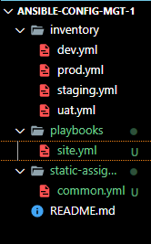

## ANSIBLE REFACTORING AND STATIC ASSIGNMENTS (IMPORTS AND ROLES)

- In this project we will continue working with ansible-config-mgt repository and make some improvements of our code. 

- We are going to refactor our Ansible code, create assignments, and learn how to use the imports functionality. 

- Imports allow to effectively re-use previously created playbooks in a new playbook. 

### Code Refactoring

Refactoring is a general term in computer programming. It means making changes to the source code without changing expected behavior of the software. The main idea of refactoring is to enhance code readability, increase maintainability and extensibility, reduce complexity, add proper comments without affecting the logic.

In our case, we will move things around a little bit in the code, but the overall state of the infrastructure remains the same.

Let us see how you can improve our Ansible code!

### Step 1 – Jenkins job enhancement

We will begin, by making some changes to our Jenkins job – now every new change in the code creates a separate directory which is not very convenient when we want to run some commands from one place. 
Futhermore, it consumes space on the Jenkins server with subsequent changes. 

We would enhance it by introducing a new Jenkins project/job – we will require Copy Artifact plugin.

In our Jenkins-Ansible server we will create a new directory called ansible-config-artifact – we will store there all artifacts after each build.

`sudo mkdir /home/ubuntu/ansible-config-artifact`

Change permissions to this directory, so Jenkins could save files there – chmod -R 0777 /home/ubuntu/ansible-config-artifact


Go to Jenkins web console -> Manage Jenkins -> Manage Plugins -> on Available tab search for 
Copy Artifact and install this plugin without restarting Jenkins


Create a new Freestyle project and name it save_artifacts.
This project will be triggered by completion of your existing ansible project. Configure it accordingly:


- Note: You can configure number of builds to keep in order to save space on the server, for example, you might want to keep only last 2 or 5 build results. You can also make this change to your ansible job.

- The main idea of save_artifacts project is to save artifacts into ***/home/ubuntu/ansible-config-artifact*** directory. To achieve this, create a Build step and choose Copy artifacts from other project, specify ansible as a source project and /home/ubuntu/ansible-config-artifact as a target directory.


We are going to test our set up by making some changes in README.MD file inside our ansible-config repository (right inside master branch).

If both Jenkins jobs have completed one after another – you shall see our files inside /home/ubuntu/ansible-config-artifact directory and it will be updated with every commit to our main branch.


## REFACTOR ANSIBLE CODE BY IMPORTING OTHER PLAYBOOKS INTO SITE.YML

DevOps philosophy implies constant iterative improvement for better efficiency – refactoring is one of the techniques that can be used, but you always have an answer to question "why?". Why do we need to change something if it works well?

[In Project 11](https://github.com/Jobijollof/DevOps-Projects2/tree/main/Project-11%20Ansible-Config) we wrote all tasks in a single playbook common.yml.

Now it is a simple set of instructions for only 2 types of OS, but imagine we have many more tasks and we need to apply this playbook to other servers with different requirements. 
In this case, we will have to read through the whole playbook to check if all tasks written there are applicable and if there  is anything that we would need to add for certain server/OS families.
Very fast, it becomes a tedious exercise and our playbook will become messy with many commented parts. Your DevOps colleagues will not appreciate such organization of your codes and it will be difficult for them to use your playbook.
Most Ansible users learn the one-file approach first. However, breaking tasks up into different files is an excellent way to organize complex sets of tasks and reuse them.

### Execution:

- Refactor Ansible code by importing other playbooks into site.yml
Before starting to refactor the codes,  we would ensure that we have pulled down the latest code from master (main) branch.

- Create a new branch, name it refactor.

Let see code re-use in action by importing other playbooks.

- Within playbooks folder, create a new file and name it site.yml – This file will now be considered as an entry point into the entire infrastructure configuration. Other playbooks will be included here as a reference. In other words, site.yml will become a parent to all other playbooks that will be developed. Including common.yml that was created previously.


- Create a new folder in root of the repository and name it static-assignments. The static-assignments folder is where all other children playbooks will be stored. This is merely for easy organization of your work. It is not an Ansible specific concept, therefore you can choose how you want to organize your work. You will see why the folder name has a prefix of static very soon. For now, just follow along.


- Move common.yml file into the newly created static-assignments folder.


After Moving  common.yml file into static-assignments folder, import common.yml playbook into 
site.yml file.

```
---
- hosts: all
- import_playbook: ../static-assignments/common.yml

```


The code above uses built in [import_playbook](https://docs.ansible.com/ansible/latest/collections/ansible/builtin/import_playbook_module.html) Ansible module.

Your folder structure should look like this;



### Run ansible-playbook command against the dev environment
There is a  need to apply some tasks to our dev servers and  since we already have wireshark installed, we will go ahead and create another playbook under static-assignments and name it common-del.yml. In this playbook,  we will configure the deletion of wireshark utility.

```
---
- name: update web, nfs and db servers
  hosts: webservers, nfs, db
  remote_user: ec2-user
  become: yes
  become_user: root
  tasks:
  - name: delete wireshark
    yum:
      name: wireshark
      state: removed

- name: update LB server
  hosts: lb
  remote_user: ubuntu
  become: yes
  become_user: root
  tasks:
  - name: delete wireshark
    apt:
      name: wireshark-qt
      state: absent
      autoremove: yes
      purge: yes
      autoclean: yes


```

- update site.yml with: 

import_playbook: ../static-assignments/common-del.yml instead of common.yml and run it against dev  servers.


```
cd /home/ubuntu/ansible-config-mgt/

ansible-playbook -i inventory/dev.yml playbooks/site.yaml

```

- I had an error


- Solution to error. I had to add the path to the keypair to dev.yml


Make sure that wireshark is deleted on all the servers by running
`wireshark --version`

We have now learned how to use import_playbooks module and we have a ready solution to install/delete packages on multiple servers with just one command.


## CONFIGURE UAT WEBSERVERS WITH A ROLE ‘WEBSERVER’

- Configure UAT Webservers with a role ‘Webserver’

We have our nice and clean dev environment, so let us put it aside and configure 2 new Web Servers as uat. We could write tasks to configure Web Servers in the same playbook, but it would be too messy, instead, we will use a dedicated role to make our configuration reusable.
Launch 2 fresh EC2 instances using RHEL 8 image, we will use them as our uat servers, so give them names accordingly – Web1-UAT and Web2-UAT.
Tip: Do not forget to stop EC2 instances that you are not using at the moment to avoid paying extra. For now, you only need 2 new RHEL 8 servers as Web Servers and 1 existing Jenkins-Ansible server up and running.
To create a role, you must create a directory called roles/, relative to the playbook file or in /etc/ansible/ directory.
There are two ways how you can create this folder structure:
Use an Ansible utility called ansible-galaxy inside ansible-config-mgt/roles directory (you need to create roles directory upfront)mkdir roles
cd roles
ansible-galaxy init webserver
Create the directory/files structure manually


